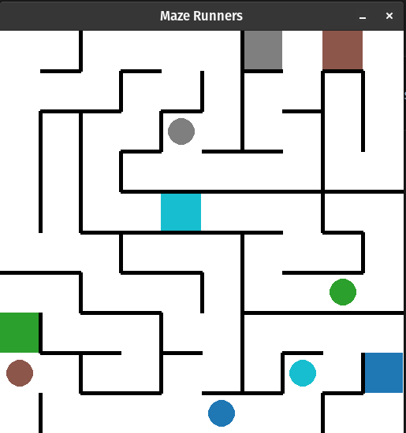

# Maze Game: Reinforcement Learning Environments

## Project Overview
This project provides a collection of customizable maze environments built for training reinforcement learning (RL) agents. The environments are designed for experimental and educational purposes, supporting tasks of increasing complexity. The goal is to offer a platform for designing, training, and evaluating RL agents in maze-based scenarios, with the added flexibility for users to build their own maze configurations and objectives. There is also base reward functions for each maze configurations and ways to change or add different rewards.

## 

## Environments
The environments generally have the following properties:
- positions are defined as `n_cols * col + row` where `(col,row)` is the cartesian coordinates of the agent.
- Use Manhattan distance or shortest path length as a distance function depending on `dist_paradigm` = 'radius' or = 'path'.


### 1. Base Maze Environment
- A discrete grid-based maze with configurable dimensions.
- Agents observe partial environment through its local vision.
- One can input mazes from the Maze generator for the agent to explore.


### 2. Single/Multi-Agent Navigation
- Single agents are trained to reach their goal.
- Agents are allowed to collide as it is ignored in this scenario, but they can see each other


### 3. Multi-Agent Collision Navigation
- Multiple agents are trained to reach their respective goals.
- Agents must avoid collisions.

### 4. Predator-Prey (Monster Environment)
- One agent (prey) aims to reach the goal.
- Another agent (monster) is trained to catch the prey.
- Competitive RL setting with separate reward signals.


## Observation View 
Agents observe their surroundings using a limited visual field, defined as a local grid centered on the agent. The observation window size is parameterized by vision_radius, leading to an input of size `(2 * vision_radius + 1, 2 * vision_radius + 1)`. Observations are processed using convolutional neural networks (CNNs) to extract spatial features.  

Different colors represent different objects the agent can see, for example, we have
- Green represents the agents own goal
- Red represents another agent
- Black represents it can not see
- Gradual white to black represents what it can see and the distance away from the agent.
- The center is blue representing the agent.

### Examples: 
Small Grid Example (3x3 vision range):
Below is a example of an agents view in a maze


## Examples of Trained Agents

### Single Agent Navigation (3x3 Grid)
This is our first attempt at an agent getting to its goal in a 3x3 grid with `vision`=3.


### Multi- Agent Navigation with Collision (3x3 Grid)


## Mathematical and Theoretical Framework
The training setups rely on:
- **Markov Decision Process (MDP)** formulations.
- **Double Deep Q-Networks (DDQN)** with prioritized experience replay (PER).
- **CNN-based feature extractors** for visual observations.
- **Target networks** with soft updates (controlled by `τ`).
- Hyperparameter optimization and reward shaping strategies.
- Distance-based potential functions are used to shape rewards for navigation efficiency.

### Key Equations
- **Bellman Equation:**
```math
Q(s,a) = r + \gamma * \max_{a'} Q(s', a')
```

- **Loss function with target networks:**
```math
L = E[(y - Q(s,a;\theta))²], \text{ where } y = r + \gamma * Q(s', \arg\max_{a'} Q(s', a'; \theta); \theta⁻)
```

- **Soft update rule:**
```math
\theta⁻ \leftarrow \tau * \theta + (1 - \tau) * \theta⁻
```

## Installation
### Requirements
- Python 3.10+
- Key dependencies:
  - imageio
  - gymnasium
  - matplotlib
  - pandas
  - pygame
  - seaborn
  - torch
  - torchvision
  - maze-dataset

### Installation Steps
#### Pip Installation
```bash
git clone <repository_url>
cd maze-game
pip install -r requirements.txt
```
#### Conda Environment
```bash
git clone <repository_url>
cd maze-game
conda env create -f environment.yml
```

## How to Use
### Example: Training a Single-Agent Environment
```python

```

### Example: Training Multi-Agent with Collision
```python

```


## Repository Structure
```text

```

## References
[A Configurable Library for Generating and Manipulating Maze Datasets](http://arxiv.org/abs/2309.10498) - Michael Igorevich Ivanitskiy, Rusheb Shah, Alex F. Spies (2015)


## Future Directions
- Add customizable observation modalities.
- Provide pretrained models for benchmarking.
- Expand to continuous control settings.

## License
This project is licensed under the MIT License.

## Contact
**Dr. Cody Tipton**    
Feel free to reach out with questions, ideas, or contributions!

