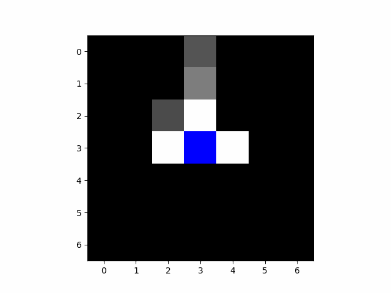

# Maze_game

## The Game and Set Up
There are two type of games we are trying to construct agents to learn.  Both require the agents to get to their goal, but with either other agents or monsters chasing them
- Hunger Maze Games:
    - This has multiple agents in a maze trying to get to their goal while trying to avoid hitting other agents or they both lose. 
    - A varient we can try is have a probability p=0.5 of one beating the other when they collide creating a "survive game"
- Resident Evil Maze:
    - This has one agent exploring the maze trying to get to their goal, but there is a monster lurking in the shadows trying to eat the agent.  Both will be learning the enviroment and their own set of rules for success and failure.  

Below is an example of the maze environment with different agents represented as circles and their goals as squares with the same colors.

## Training Data
- The training data that the agent will have when proecessing its environemtn is a (2*vision + 1, 2*vision + 1) shape RBG colored image of the surronding environemnt, as we can see below.  The green represents the agents own goal, red represents other agents or monsters, while the center is the agent itself.

- We also include some global information including the following:
    - the goal and agents position represented $$\text{pos} = \text{total cols} \cdot \text{col} + \text{row}$$.
    - distance to the goal using either the Manhatton distance if using a radius type distance for the agent (suitable for grid world) or as the length of the path to the goal minus one,
    - and if the agent is done.

## The Models
In each of our models we are using a convolutional neural network for the spatial information in the beginning and combining it with the global information later in the network.

## Examples
Below we will have gifs of our agents so far in different scenarios

